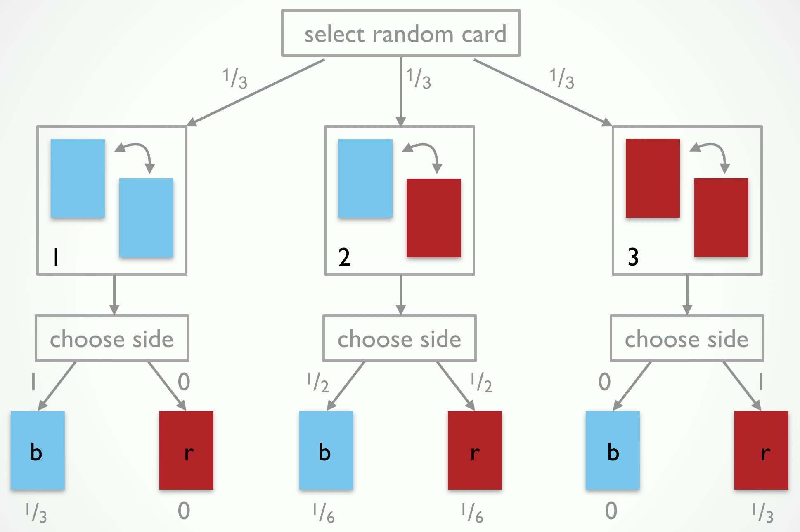
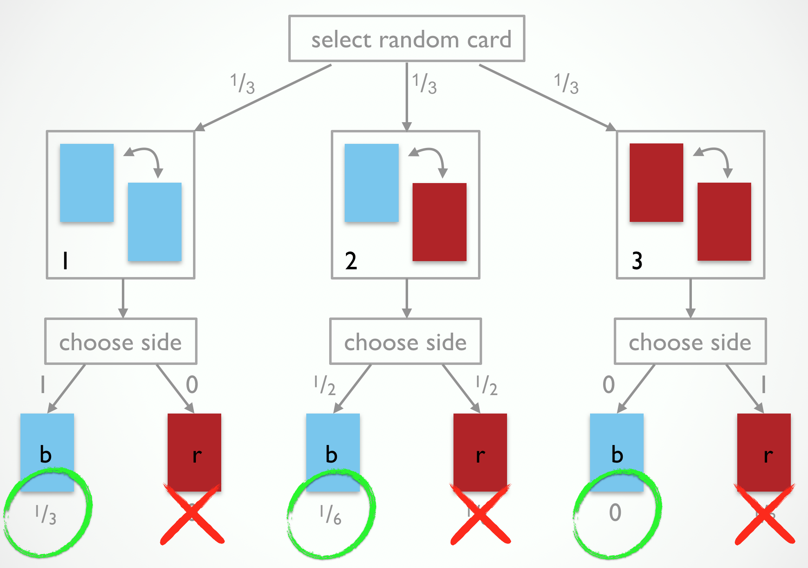

### Appendix chapter 01: Probabilities & Bayes rule (in WebPPL)

*Author: Michael Franke*

##### The 3-card problem: motivating Bayesian reasoning

Jones is not a magician or a trickster, so you do not have to fear. He just likes probability puzzles. He shows you his deck of three cards. One is blue on both sides. A second is blue on one side and red on the other. A third is red on both sides. Jones shuffles his deck, draws a random card (without looking), selects a random side of it (without looking) and shows it to you. What you see is a blue side. What do you think the probability is that the other side, which you presently do not see, is blue as well?

Many people believe that the chance that the other side of the card is blue is .5; that there is a 50/50 chance of either color on the back. After all, there are six sides in total, half of which are blue, and since you do not know which side is on the back, the odds are equal for blue and red.

This is faulty reasoning. It looks only at the base rate of sides. It fails to take into account the **observation-generating process**, i.e., the way in which Jones manipulates his cards and "generates an observation" for you. For the 3-cards problem, the observation-generating process can be visualized as in Fig. 1.

Fig. 1: The observation-generating process for the 3-card problem. Jones selects a random card, then chooses a random side of it.

The process tree in Fig. 1 also shows the probabilities with which events happen at each choice point during the observation-generating process. Each card is selected with equal probability $$\frac{1}{3}$$. The probability of showing a blue side is 1 for the blue-blue card, .5 for the blue-red card, and 0 for the red-red card. The leaves of the tree show the probabilities, obtained by multiplying all probabilities along the branches, of all 6 traversal of the tree (including the logically impossible ones, which naturally receive a probability of 0). 

If we combine our knowledge of the observation-generating process in Fig. 1 with the observation that the side shown was blue, we should eliminate the outcomes that are incompatible with it, as shown in Fig. 2. What remains are the probabilities assigned to branches that are compatible with our observation. But they do not sum to 1. If we therefore renormalize (here: division by .5), we end up believing that it is twice as likely for the side which we have not observed to be blue as well. The reason is because the blue-blue card is twice as likely to have generated what we observed than the blue-red card is.

Fig. 2: The observation-generating process for the 3-card problem after eliminating outcomes incompatible with the observation "blue".

The latter reasoning is actually an instance of Bayes rule. For our purposes, we can think of Bayes rule as a normatively correct way of forming (subjective) beliefs about which causes have likely generated an observed effect, i.e., a way of reasoning probabilistically and defeasibly about likely explanations for what has happened. In probabilistic pragmatics we will use Bayes rule to capture the listener's attempt of recovering what a speaker may have had in mind when she made a particular utterance. In other words, probabilistic pragmatics treats pragmatic interpretation as probabilistic 
inference to the best explanation of what worldly states of affairs, mental states and contextual factors would have caused the speaker to act in the manner observed.

You should now feel very uncomfortable. Did we not just say that most people fail at probabilistic reasoning tasks like the 3-card problem? (Other prominent examples would be the two-box problem or the [Monty Hall problem](https://en.wikipedia.org/wiki/Monty_Hall_problem).) Yes, we did. But there is also a marked contrast between probability puzzles and natural language understanding. One reason for why many people fail to show the correct probabilistic reasoning in the 3-card problem is because they neglect the precise nature of the observation-generating process. The process by which Jones selects his cards is not particularly familiar to us. (When is the last time you performed this card selection procedure.) In contrast, every speaker is intimately familiar with the production of utterances to express ideas. It is arguably a hallmark of human language that we experience ourselves in the role of the producer (compare [Hockett's design features of language](https://en.wikipedia.org/wiki/Hockett%27s_design_features), in particular **total feedback**). On this construal, pragmatic interpretation is (in part) a simulation process of what we might have said to express such-and-such in such-and-such contextual conditions.

##### Probability distributions & Bayes rule

If $$X$$ is a (finite) set of mutually discrete outcomes (results of an experiment, utterances, interpretations ... ), a (discrete) probability distribution over $$X$$ is a function $$P \colon X \rightarrow [0;1]$$ such that $$\sum_{x \in X} P(x) = 1$$. For any subset $$ Y \subseteq X$$ we further define $$P(Y) = \sum_{x \in Y} P(x)$$. 

Consider the example of a 2-dimensional probability table. It gives probabilities for meeting a person with a particular hair and eye color. 

|                    | brown            | blue         |    green     |
|:-------------------|:----------------:|:------------:|:------------:|
| **black**	 		 |	   .4		   |	 .02		  |	 .01
| **brown**			 |		.1		   |	.3		  |	  .1
| **red**            |      .01       |     .01      |  .05

Formally, we have $$X = H \times E$$ with $$H = \{ \text{black}, \text{blond}, \text{red} \}$$ and $$E = \{ \text{brown}, \text{blue}, \text{green} \}$$. The probability of meeting a person with black hair and green eyes would accordingly be $$P(\langle \text{black}, \text{green} \rangle) = .01$$.

Denote with $$\text{"black"}$$ the proposition of meeting a person with black hair. This is a subset of the outcome space: $$\text{"black"} = \{ \langle h , e \rangle \in X \mid h = \text{black} \}$$. Similarly, for other hair and eye colors. The probability of meeting a person with black hair is obtained by **marginalization**: $$P(\text{"black"}) = .4 + .02 + .01 = .43$$.

If $$A, B \subseteq X$$ with $$B \neq \emptyset$$, the **conditional probability** of $$A$$ given $$B$$ is

$$P(A \mid B) = \frac{P(A \cap B)}{B}$$

For example, the conditional probability of a person to have black hair given that she has green eyes is:

$$P(\text{"black"} \mid \text{"green"}) = \frac{.01}{.01 + .1 + .05} = \frac{1}{16} = 0.0625$$

A direct consequence of this definition is **Bayes rule** which relates the conditional probability of $$A$$ given $$B$$ to the conditional probability of $$B$$ given $$A$$:

$$P(A \mid B) = \frac{P(B \mid A) \ P(A)}{P(B)}$$

Bayes rule is most useful for abductive reasoning to the best explanation of an observation (effect) based on some unobservable cause. Consider the 3-card problem again. We would like to infer which card Jones selected based on what we saw (i.e., only one side of it). In other words, we would like to know the conditional probability of, say the blue-blue card, given that we have observed one blue side: $$P(\text{blue-blue} \mid \text{obs. blue})$$. What we have is an observation-generating process that specifies the reverse, namely the conditional probability of observing blue or red, given a card. Formally, we would get:

$$P(\text{blue-blue} \mid \text{obs. blue}) = \frac{P(\text{obs. blue} \mid \text{blue-blue}) \ P(\text{blue-blue})}{P(\text{obs. blue})}$$

$$ = \frac{1 \cdot \frac{1}{3}}{\frac{1}{2}} = \frac{2}{3} $$

##### Bayes rule in WebPPL

To implement Bayes rule in WebPPL we need to specify the observation-generating process. The following function generates a single observation for the process by which Jones selects and shows a card.

~~~~

// three cards; with blue or red on either side
var cards = [["blue", "blue"],
             ["blue", "red"],
             ["red", "red"]]
  
var select_card_and_color = function() {
  var card  = uniformDraw(cards)
  var color = uniformDraw(card)
  return color
}

select_card_and_color()
			 
~~~~

To obtain the conditional probability of a card given that we observed blue, we need two special-purpose constructions in WebPPL. First, we add which event to condition on with the `condition(...)` function. Second, we use `Infer` to pick up all the relevant information (including `condition(...)`, which is only allowed in conjunction with `Infer`), and to return the posterior distribution, by Bayes rule.

~~~~

// three cards; with blue or red on either side
var cards = [["blue", "blue"],
             ["blue", "red"],
             ["red", "red"]]

var model = function() {
  var card  = uniformDraw(cards)
  var color = uniformDraw(card)
  condition(color == "blue")
  return card.join("-")
}

viz.table(Infer({method: "enumerate", 
                 model: model
                }))
			 
~~~~

