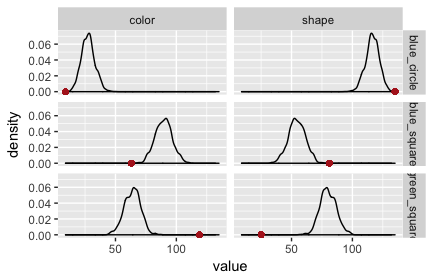
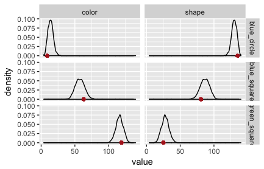
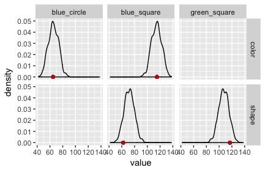

### Appendix chapter 2: Bayesian data analysis for the RSA reference game model

*Author: Michael Franke*

WebPPL allows us to conveniently specify even complex probabilistic cognitive models and to explore the predictions these models make. Usually these predictions are probabilistic. For example, the RSA model might predict that the probability $$P_{L_1}(s \mid u)$$ that a pragmatic listener assigns to interpretation $$s$$ after hearing utterance $$u$$ is $$.7$$. Sometimes it suffices for our explanatory purposes to just obtain such (probabilistic) predictions. For example, we might want to explain that the listener's assumptions about the speaker's knowledge impact conclusions about scalar implicatures in a particular qualitative but systematic way (see [Chapter 2](02-pragmatics.html)). Sometimes, however, our explanatory amibitions are more adventurous. Sometimes we like to explain quantitative data, e.g., from observational experiments or corpora. In this case, WebPPL makes it easy to analyse our experimental data through the lens of our probabilistic cognitive models; or, put the other way around, reason about unknown parameters (such as: which model to believe in) based on the data observed.

#### Motivating example

Consider the vanilla RSA model from [Chapter 1](01-introduction.html) once more. The model is intended to explain data from reference games, such as pictured in Fig. 1.

Fig. 1: Example referential communication scenario from Frank and Goodman. Speakers choose a single word, <i>u</i>, to signal an object, <i>s</i>.

The vanilla RSA model defines a literal and a pragmatic listener rule, both of which map utterances $$u \in U$$ to probability distributions over states/objects $$s \in S$$: $$P_{L_{0,1}} \colon U \rightarrow \Delta(S)$$. Let us use the code below to look at how literal and pragmatic listeners would interpret the utterance "blue" for the example from [Chapter 1](01-introduction.html). (The predictions for the pragmatic listener depend on the optimization parameter $$\alpha$$. It is here set to $$1$$. We will come back to this below.)

~~~~
// Frank and Goodman (2012) RSA model

// set of states (here: objects of reference)
var states = ["blue_circle", "green_square", "blue_square"]

// set of utterances
var utterances = ["blue","green","square","circle"]

// prior over world states
var objectPrior = function() {
  uniformDraw(states)
}

// meaning function to interpret the utterances
var meaning = function(utterance, obj){
  _.includes(obj, utterance)
}

// literal listener
var literalListener = function(utterance){
  Infer({model: function(){
    var obj = objectPrior();
    condition(meaning(utterance, obj))
    return obj
  }})
}

// set speaker optimality
var alpha = 1

// pragmatic speaker
var speaker = function(obj){
  Infer({model: function(){
    var utterance = uniformDraw(utterances)
    factor(alpha * literalListener(utterance).score(obj))
    return utterance
  }})
}

// pragmatic listener
var pragmaticListener = function(utterance){
  Infer({model: function(){
    var obj = objectPrior()
    observe(speaker(obj),utterance)
    return obj
  }})
}

display("Literal listener's interpretation of 'blue':")
viz.table(literalListener("blue"))
display("Pragmatic listener's interpretation of 'blue':")
viz.table(pragmaticListener("blue"))
~~~~

Suppose we conducted a simple experiment in which we provide the referential context in Fig. 1 above and ask human participants to choose the object which they believe that a speaker who chose utterance "blue" might have meant. The experiment of reft:frankgoodman2012 was slightly different (a betting paradigm in which participants had to distribute 100 points over the potential referents), but reft:QingFranke2013:Variations-on-a executed exactly such a **forced choice experiment**, in which each participant had to choose exactly one referent. They observed that in all conditions structurally equivalent to an observation of utterance "blue" in the context of Fig. 1, 115 participants chose the blue square and 65 chose the blue circle, while nobody (phew!) chose the green square.

~~~~
var comp_data = {
  blue:   {blue_circle: 65, green_square:   0, blue_square: 115},
}
~~~~

What can we do with this data and our model? - Generally, a lot! Much depends on what we want. We could summon **classical statistics**, for example, to test whether an observation of 115 successes in 115+65 = 180 trials is surprising under a **null hypothesis** that assumes, like a literal listener model does, that successes and failures are equally likely. Indeed, a binomial test gives a highly significant result ($$p \le 0.001$$), which is standardly interpreted as an indication that the null hypothesis is to be rejected. In our case this means that it is highly unlikely that the data observed was generated by a literal listener model.

**Bayesian data analysis** is different from classical hypothesis testing. From a Bayesian point of view, we rather ask: how likely is it that the literal listener model or the pragmatic listener model has generated the observed results? Suppose that we are initially completely undecided about which model is likely correct, but (for the sake of a simple example) consider only those two listener models. Then our **prior belief** in each model is equal $$P(M_{L_0}) = P(M_{L_1}) = 0.5$$, where $$M_{L_0}$$ and $$M_{L_1}$$ are the literal and pragmatic listener model, respectively. Our **posterior belief** after observing data $$D$$ concerning the probability of $$M_{L_0}$$ can be calculated by Bayes rule:

$$ P(M_{L_0} \mid D) = \frac{ P(M_{L_0}) \cdot P(D \mid M_{L_0})}{P(M_{L_0}) \cdot P(D \mid M_{L_0})  +  P(M_{L_1}) \cdot P(D \mid M_{L_1})}$$

Since prior beliefs are equal, they cancel out, leaving us with:

$$ P(M_{L_0} \mid D) = \frac{P(D \mid M_{L_0}) }{P(D \mid M_{L_0}) + P(D \mid M_{L_1}) }$$

The remaining terms are of the form $$P(D \mid M)$$ and refer to the **likelihood** of the data $$D$$ under each model, i.e., how likely the actually observed data was from each model's point of view. We can easily calculate them in WebPPL and retrive the corresponding posterior beliefs:

~~~~
var total_observations = 180
var observed_successes = 115
var LH_literalLister = Math.exp(Binomial({n: total_observations, p: 0.5}).score(observed_successes))
var LH_pragmatLister = Math.exp(Binomial({n: total_observations, p: 0.6}).score(observed_successes))
var posterior_literalListener = LH_literalLister /
    (LH_literalLister + LH_pragmatLister)
print(posterior_literalListener)

~~~~

> **Exercises:**

> 1. What is the probability $$P(M_{L_1} \mid D)$$ of the pragmatic listener model given the data?
> 2. How much more likely is the pragmatic listener model than the literal listener model, given the data?
> 3. Play around with different values for `observed_successes`. For which of these will the literal listener model be more likely?
> 4. Play around with different values for `total_observations`. What happens to our beliefs if we observe more data rather than less, while keeping the ratio between `total_observations` and `observed_successes` the same? (Just multiply both `total_observations` and `observed_successes` with the same factor to explore this.)

#### Parameter estimation

Above we compared two models, each of which made exact (probabilistic) predictions (i.e., 0.5 vs 0.6).
If we consider the pragmatic listener more closely, we realize that there is more than just *one* pragmatic listener model but many, each one corresponding to a different value of $$\alpha$$.
In fact, as $$\alpha \rightarrow 0$$, the pragmatic listener model makes the same predictions as the literal listener model.
So, the literal listener model can be seen as a special case of the pragmatic listener, when $$\alpha = 0$$.
To convince yourself of this, go to the RSA model below---in which `alpha` is made as an argument to the `pragmaticListener` function---and run it by setting `alpha` to different values.

~~~~
// Frank and Goodman (2012) RSA model

// set of states (here: objects of reference)
var states = ["blue_circle", "green_square", "blue_square"]

// set of utterances
var utterances = ["blue","green","square","circle"]

// prior over world states
var objectPrior = function() {
  uniformDraw(states)
}

// meaning function to interpret the utterances
var meaning = function(utterance, obj){
  _.includes(obj, utterance)
}

// literal listener
var literalListener = function(utterance){
  Infer({model: function(){
    var obj = objectPrior();
    condition(meaning(utterance, obj))
    return obj
  }})
}

// pragmatic speaker
var speaker = function(obj, alpha){ //alpha is now an argument
  Infer({model: function(){
    var utterance = uniformDraw(utterances)
    factor(alpha * literalListener(utterance).score(obj))
    return utterance
  }})
}

// pragmatic listener
var pragmaticListener = function(utterance, alpha){ //alpha is now an argument
  Infer({model: function(){
    var obj = objectPrior()
    observe(speaker(obj, alpha),utterance) // pass alpha to the speaker function
    return obj
  }})
}

display("Literal listener's interpretation of 'blue':")
viz.table(literalListener("blue"))
display("Pragmatic listener's interpretation of 'blue':")
viz.table(pragmaticListener("blue", 1)) // we now need to supply alpha here
~~~~

> **Exercises:**

> 1. Check that $$\alpha \rightarrow 0$$ gives predictions identical to the literal listener's rule.
> 2. What happens if we feed in $$\alpha = 0$$? Why is this happening?

In a sense, we now have infinitely many models, one for each value of $$\alpha$$. Another equivalent way of looking at this is to say that we have one model $$M_{L_1}$$ whose probabilistic predictions depend on the value of the parameter $$\alpha$$. In other words, we have defined a parameterized likelihood function for observational data $$P(D \mid M_{L_1}, \alpha)$$. Whenever it is clear what the model is, we can drop the reference to the model from our notation. For the general case of possibly high-dimensional continuous parameter vector $$\theta$$, we can use Bayes rule for **parameter inference** like so:

$$ P(\theta \mid D) = \frac{P(\theta) \cdot P(D \mid \theta)}{ \int P(\theta) \cdot P(D \mid \theta') \ \text{ d} \theta'}$$

For complex models with unwieldy parameter spaces, the above formula can quickly become intractable. The problem is in the normalizing constant, the so-called **marginal likelihood**. ("Likelihood" because we sum over, so to speak, the likelihood $$P(D \mid \theta)$$ of the data; "marginal" because we marginalize over (think: compute a probability-weighted sum over) all parameter values.) But even if the above is not calculable with a single precise mathematical formula, there are ways of obtaining samples from the posterior distribution which do not require knowledge of an easily computable representation of the marginal likelihood. **Markov Chain Monte Carlo (MCMC) methods** are a family of algorithms that provide this. Concretely, MCMC methods provide a clever and efficient way of generating samples from $$P(\theta \mid D)$$ by using only the non-normalized posterior scores, i.e., the product of prior and likelihood at a single parameter value $$\theta$$, which is usually very fast and easy to compute (at least relative to the integral needed for the marginal likelihood):

$$ P(\theta \mid D) \propto P(\theta) \cdot P(D \mid \theta)$$

Notice that sampling-based approximations of probability distributions are at the heart of probabilistic programming, Consequently, WebPPL has functionality for MCMC-driven inference built in. To allow the computation of samples from the posterior over optimality parameter $$\alpha$$ in our simple running example, we need to define a function (see code box below) which basically implements the non-normalized posterior scores of the last formula above, in such a way that WebPPL understand what is what:

~~~~
// Frank and Goodman (2012) RSA model

///fold:

// set of states (here: objects of reference)
var states = ["blue_circle", "green_square", "blue_square"]

// set of utterances
var utterances = ["blue","green","square","circle"]

// prior over world states
var objectPrior = function() {
  uniformDraw(states)
}

// meaning function to interpret the utterances
var meaning = function(utterance, obj){
  _.includes(obj, utterance)
}

// literal listener
var literalListener = function(utterance){
  Infer({model: function(){
    var obj = objectPrior();
    condition(meaning(utterance, obj))
    return obj
  }})
}

// pragmatic speaker
var speaker = function(obj, alpha){ //alpha is now an argument
  Infer({model: function(){
    var utterance = uniformDraw(utterances)
    factor(alpha * literalListener(utterance).score(obj))
    return utterance
  }})
}

// pragmatic listener
var pragmaticListener = function(utterance, alpha){ //alpha is now an argument
  Infer({model: function(){
    var obj = objectPrior()
    observe(speaker(obj, alpha),utterance) // pass alpha to the speaker function
    return obj
  }})
}

///

// Data analysis

var non_normalized_posterior = function(){
  // prior over model parameter
  var alpha = uniform({a:0, b:10})
  var predicted_probability =
      Math.exp(
        pragmaticListener("blue", alpha).score("blue_square")
      )
  var likelihood = Binomial({n: 180, p: predicted_probability}).score(115)    
  factor(likelihood)
  return {alpha}
}

var posterior_samples = Infer({
  method: "MCMC",
  samples: 10000, // how many samples to obtain
  burn: 1500,     // number of steps for algorithm to adapt
  model: non_normalized_posterior})

viz(posterior_samples)  
~~~~

> **Exercises:**

> 1. Looking at the density plot that results from this computation, which region of $$\alpha$$ values is most likely given the data?
> 2. Are the special cases of $$\alpha = 1$$ and $$\alpha = 0$$ competitive, or are they very clearly much worse than the "best values"?
> 3. Bayesian posterior inference depends on the specification of a prior over parameters. The above code originally uses a uniform prior over $$\alpha$$: `var alpha = uniform({a:0, b:10})`. Adapt the code above to retrieve samples just from the prior by commenting out the `factor` statement.
> 4. Change the prior for $$\alpha$$ to a non-uniform prior, using a Gamma distribution: `var alpha = gamma({shape:0.1, scale:10})`. Plot samples from this prior to get a feeling for the shape of this prior. What do you think is going to happen when we use this prior for Bayesian posterior inference?
> 5. Add the commented-out `factor` statement back in and inspect the result. Try to see that Bayesian posterior inference over parameters is a mixture of prior and likelihood terms.
> 6. What do you think will happen when we increase or decrease the number of observations while keeping the ratio of total observations to observed counts constant (like in a previous exercise)? Try it!

Let us take stock. The last example showed how to do data-driven Bayesian inference of a model parameter. **Bayesian parameter estimation** tells us what we should rationally believe about the values of parameters, given the observed data and the postulated model. The model in question here contains both the prior and the likelihood function; Bayesian inference depends on the prior over parameters. We can take flat, so-called **uninformative priors** if we are mainly agnostic in the beginning and simply interested in the shape of the likelihood surface. If parameters are meaningful and if we have knowledge (from previous experiments or other sources), this knowledge can (and some say: should) be fed into the priors and so becomes part of the modeller's hypothesis of the data-generating process. 

#### Full example

The previous example only contained a single condition from the experiments reported by reft:QingFranke2013:Variations-on-a. The full data set additionally contains data for (conditions equivalent to) a listener observing the utterance "square" in contexts like Fig. 1, and also the number of times participants chose particular properties. In other words, the data collected contains both (speaker) production and (listener) comprehension data. Following reft:frankgoodman2012, there was also a salience prior condition, which was like a listener condition but where participants were told that the observed word was unintelligible. reft:frankgoodman2012 used data from this condition to feed into the `objectPrior` of the RSA model (we will enlarge on this below). Here is the full data from reft:QingFranke2013:Variations-on-a:

~~~~

var salience_priors = {
  blue_circle:   71,  // object "blue circle" was selected 71 times
  green_square: 139,
  blue_square:   30,
}

var prod_data = {
  blue_circle:  {blue:  9, circle: 135, green:   0, square:  0},
  green_square: {blue:  0, circle:   0, green: 119, square: 25},
  blue_square:  {blue: 63, circle:   0, green:   0, square: 81}
}

var comp_data = {
  blue:   {blue_circle: 65, green_square:   0, blue_square: 115},
  square: {blue_circle:  0, green_square: 117, blue_square:  62}
}

~~~~

Several things are noteworthy here. First, in the salience prior condition, most participants found the object with the unique color (green square) the most likely referent, followed by the object with the unique shaqe (blue circle). The differences between choice counts in the salience prior condition is rather pronounced. We include these counts as an empirically informed proxy for the `objectPrior` in the RSA model below.

~~~~

var salience_priors = {
  blue_circle:   71,  // object "blue circle" was selected 71 times
  green_square: 139,
  blue_square:   30,
}

// prior over world states
var objectPrior = function() {
  categorical({ps: _.values(salience_priors), // empirical data 
               vs: states}) 
}

repeat(objectPrior, 1000)               

~~~~

Second, as expected from a Gricean or RSA-based point of view, participants more frequently selected a more informative (here: unique) property. But on top of that, there seems to be a tendency to select a shape term. To investigate this issue further we are going to include non-uniform costs into the RSA model. In particular, we include an additive cost term $$c$$ for the use of a color property, like so:

~~~~

// function for utterance costs
var cost = function(utterance, c) {
  (utterance === "blue" || utterance === "green") ? c : 0
}

// pragmatic speaker
var speaker = function(obj, alpha, c){
  Infer({model: function(){
    var utterance = uniformDraw(utterances)
    factor(alpha * (literalListener(utterance).score(obj) -
                    cost(utterance,c)))
    return utterance
  }})
}

// pragmatic listener also receives cost term 'c'

~~~~

The full model, including empirically measured salience priors and cost terms, is this:

~~~~

// print function 'condProb2Table' for conditional probability tables
///fold:
var condProb2Table = function(condProbFct, row_names, col_names, precision){
  var matrix = map(function(row) {
    map(function(col) {
      _.round(Math.exp(condProbFct(row).score(col)),precision)}, 
        col_names)}, 
                   row_names)
  var max_length_col = _.max(map(function(c) {c.length}, col_names))
  var max_length_row = _.max(map(function(r) {r.length}, row_names))
  var header = _.repeat(" ", max_length_row + 2)+ col_names.join("  ") + "\n"
  var row = mapIndexed(function(i,r) { _.padEnd(r, max_length_row, " ") + "  " + 
                       mapIndexed(function(j,c) {
                          _.padEnd(matrix[i][j], c.length+2," ")}, 
                                  col_names).join("") + "\n" }, 
                           row_names).join("")
  return header + row
}

///

////////////////
// OBSERVED DATA
////////////////

///fold:
var salience_priors = {
  blue_circle:   71,  // object "blue circle" was selected 71 times
  green_square: 139,
  blue_square:   30,
}

var prod_data = {
  blue_circle:  {blue:  9, circle: 135, green:   0, square:  0},
  green_square: {blue:  0, circle:   0, green: 119, square: 25},
  blue_square:  {blue: 63, circle:   0, green:   0, square: 81}
}

var comp_data = {
  blue:   {blue_circle: 65, green_square:   0, blue_square: 115},
  square: {blue_circle:  0, green_square: 117, blue_square:  62}
}
///

////////////
// RSA MODEL
////////////

// set of states (here: objects of reference)
var states = ["blue_circle", "green_square", "blue_square"]

// set of utterances
var utterances = ["blue","circle","green","square"]

// prior over world states
var objectPrior = function() {
  categorical({ps: _.values(salience_priors), // empirical data 
               vs: states}) 
}

// meaning function to interpret the utterances
var meaning = function(utterance, obj){
  _.includes(obj, utterance)
}

// literal listener
var literalListener = function(utterance){
  Infer({model: function(){
    var obj = objectPrior();
    condition(meaning(utterance, obj))
    return obj
  }})
}

// function for utterance costs
var cost = function(utterance, c) {
  (utterance === "blue" || utterance === "green") ? c : 0
}

// pragmatic speaker
var speaker = function(obj, alpha, c){
  Infer({model: function(){
    var utterance = uniformDraw(utterances)
    factor(alpha * (literalListener(utterance).score(obj) -
                    cost(utterance,c)))
    return utterance
  }})
}

// pragmatic listener
var pragmaticListener = function(utterance, alpha, c){
  Infer({model: function(){
    var obj = objectPrior()
    observe(speaker(obj, alpha, c),utterance)
    return obj
  }})
}

// model parameters
var alpha = 1
var c = 0

// display full probability tables

display("literal listener")
display(condProb2Table(literalListener, utterances, states,2))

// display("speaker")
// display(condProb2Table(function(s) {speaker(s,alpha,c)}, states, utterances,2))

// display("pragmatic listener")
// display(condProb2Table(function(u) {pragmaticListener(u,alpha,c)}, utterances, states,2))

~~~~

> **Exercises:**

> 1. Look at the changes to `objectPrior`, call the `literalListener` function for various utterances and make sure that you understand why you see the results that you see.
> 2. Look at the speaker's interpretation of "blue". Use cost `c = 0` first and then modify the costs to inspect how they change the speaker's utterance choice probabilities.
> 3. Test how different cost values affect the pragmatic listener's interpretation.

#### Parameter estimation for full data set

The current model has two parameters, optimality $$\alpha$$ and an utterance cost $$c$$ that differentiates shape from color terms. The latter is theoretically interesting: does the observed data lead us to believe that $$c$$ should be substantially different from zero? 

~~~~

////////////////
// OBSERVED DATA
////////////////

///fold:
var salience_priors = {
  blue_circle:   71,  // object "blue circle" was selected 71 times
  green_square: 139,
  blue_square:   30,
}

var prod_data = {
  blue_circle:  {blue:  9, circle: 135, green:   0, square:  0},
  green_square: {blue:  0, circle:   0, green: 119, square: 25},
  blue_square:  {blue: 63, circle:   0, green:   0, square: 81}
}

var comp_data = {
  blue:   {blue_circle: 65, green_square:   0, blue_square: 115},
  square: {blue_circle:  0, green_square: 117, blue_square:  62}
}
///

////////////
// RSA MODEL
////////////

///fold:

// set of states (here: objects of reference)
var states = ["blue_circle", "green_square", "blue_square"]

// set of utterances
var utterances = ["blue","circle","green","square"]

// prior over world states
var objectPrior = function() {
  categorical({ps: _.values(salience_priors), // empirical data 
               vs: states}) 
}

// meaning function to interpret the utterances
var meaning = function(utterance, obj){
  _.includes(obj, utterance)
}

// literal listener
var literalListener = function(utterance){
  Infer({model: function(){
    var obj = objectPrior();
    condition(meaning(utterance, obj))
    return obj
  }})
}

// function for utterance costs
var cost = function(utterance, c) {
  (utterance === "blue" || utterance === "green") ? c : 0
}

// pragmatic speaker
var speaker = function(obj, alpha, c){
  Infer({model: function(){
    var utterance = uniformDraw(utterances)
    factor(alpha * (literalListener(utterance).score(obj) -
                    cost(utterance,c)))
    return utterance
  }})
}

// pragmatic listener
var pragmaticListener = function(utterance, alpha, c){
  Infer({model: function(){
    var obj = objectPrior()
    observe(speaker(obj, alpha, c),utterance)
    return obj
  }})
}
///

////////////////
// Data Analysis
////////////////

var dataAnalysis = function(){
  
  // priors over parameters of interest
  
  var alpha = uniform({a:0, b:10})
  var c = uniform({a:-4, b:4})

  // speaker production part
  
  map(function(s){ // anonymous call to "map" around "observe" -> think: for-loop
    
    var speaker_predictions = speaker(s, alpha, c)
    var speaker_data = prod_data[s]
    
    var utt_probs = map(function(u){
      return Math.exp(speaker_predictions.score(u))
    }, _.keys(speaker_data))

    var utt_count = map(function(u){
      return speaker_data[u]
    }, _.keys(speaker_data))
    
    observe(Multinomial({n: sum(utt_count), 
                         ps: utt_probs}), 
            utt_count)

    }, states)
 
  // listener comprehension part
  
  map(function(u){ // anonymous call to "map" around "observe" -> think: for-loop

    var listener_predictions = pragmaticListener(u, alpha, c)
    var listener_data = comp_data[u]

    var int_probs = map(function(s){
      return Math.exp(listener_predictions.score(s))
    }, _.keys(listener_data))

    var int_count = map(function(s){
      return listener_data[s]
    }, _.keys(listener_data))

    observe(Multinomial({n: sum(int_count), 
                         ps: int_probs}), 
            int_count)

  }, _.keys(comp_data))
 
  return {alpha: alpha, costs: c}
}

var parameter_estimation = Infer({
  method: "MCMC",
  samples: 10000,
  burn: 2000,
  model: dataAnalysis})

viz(parameter_estimation)
viz.marginals(parameter_estimation)

~~~~

> **Exercises:**

> 1. Based on the density plot of the marginal distribution of the cost parameter, would you conclude that value `c = 0` is credible?

### Model criticism

Data-driven parameter inference tells us which values of parameters are credible, given the data and the model. But such an inference is trustworthy and useful only to the extend that the model (think: the theory that feeds into the likelihood function) is credible and justified by the data. It is therefore important to assess how well a given model is able to account for the data. **Model criticism** is where we ask: which aspects of our data set are (un-)problematic for the model at hand? From an answer to this question, the current model could be revised or replaced by an alternative model. It's here that, ideally, scientific progress and an enhanced understanding happens: "aha, our previous assumptions failed to explain observation such-and-such; to explain this we must rather assume this-and-that".

A simple but powerful method for Bayesian model criticism are **posterior predictive checks**. This method looks at the predictions our model makes after it is trained on the data at hand (hence the term "posterior"). We then look at the predictions this trained model would make about hypothetical future replications of the same experiment that we used to train the model on (hence the term "predictive"). We then check whether (or better: where) the actually observed data looks different from what we expect to see if the trained model was wrong. If the trained model systematically fails to generate predicitions that look like the data it was trained on, this is a clear indication that it missed some regularity in the data set. (It then still falls to theoretical considerations to judge how systematic and notionally important any particular divergences are; maybe we care, maybe these aspects are not our research focus.)

Probabilistic programming tools like WebPPL make it easy to gather samples from the **posterior predicitive distribution**:

$$ P(D^{rep} \mid M, D^{obs}) = \int P(\theta \mid M, D^{obs}) \cdot P(D^{rep} \mid M, \theta) \text{ d}\theta $$

As the definition above suggests, we merely need to sample parameter values from the posterior distribution, given our data $$P(\theta \mid M, D^{obs})$$, which we already know how to do from parameter inference. For each sample of $$\theta$$ from the posterior distribution, we then sample a hypothetical datum from the same likelihood function which we assumed for our original data, i.e., we sample a bunch of $$D^{rep}$$, each with probability $$P(D^{rep} \mid M, \theta)$$.

~~~~

////////////////
// OBSERVED DATA
////////////////

///fold:

var salience_priors = {
  blue_circle:   71,  // object "blue circle" was selected 71 times
  green_square: 139,
  blue_square:   30,
}

var prod_data = {
  blue_circle:  {blue:  9, circle: 135, green:   0, square:  0},
  green_square: {blue:  0, circle:   0, green: 119, square: 25},
  blue_square:  {blue: 63, circle:   0, green:   0, square: 81}
}

var comp_data = {
  blue:   {blue_circle: 65, green_square:   0, blue_square: 115},
  square: {blue_circle:  0, green_square: 117, blue_square:  62}
}

///

////////////
// RSA MODEL
////////////

///fold:

// set of states (here: objects of reference)
var states = ["blue_circle", "green_square", "blue_square"]

// set of utterances
var utterances = ["blue","circle","green","square"]

// prior over world states
var objectPrior = function() {
  categorical({ps: _.values(salience_priors), // empirical data 
               vs: states}) 
}

// meaning function to interpret the utterances
var meaning = function(utterance, obj){
  _.includes(obj, utterance)
}

// literal listener
var literalListener = function(utterance){
  Infer({model: function(){
    var obj = uniformDraw(states);
    condition(meaning(utterance, obj))
    return obj
  }})
}

// function for utterance costs
var cost = function(utterance, c) {
  (utterance === "blue" || utterance === "green") ? c : 0
}

// pragmatic speaker
var speaker = function(obj, alpha, c){
  Infer({model: function(){
    var utterance = uniformDraw(utterances)
    factor(alpha * (literalListener(utterance).score(obj) -
                    cost(utterance,c)))
    return utterance
  }})
}

// pragmatic listener
var pragmaticListener = function(utterance, alpha, c){
  Infer({model: function(){
    var obj = objectPrior()
    observe(speaker(obj, alpha, c),utterance)
    return obj
  }})
}

///

////////////////
// Data Analysis
////////////////

var posterior_predictive = function(){
  
  // priors over parameters of interest
  
  var alpha = uniform({a:0, b:10})
  var c = uniform({a:-0.4, b:0.4})

  // speaker production part
  
  var PP_speaker = map(function(s){
    
    var speaker_predictions = speaker(s, alpha, c)
    var speaker_data = prod_data[s]
    
    var utt_probs = map(function(u){
      return Math.exp(speaker_predictions.score(u))
    }, _.keys(speaker_data))

    var utt_count = map(function(u){
      return speaker_data[u]
    }, _.keys(speaker_data))
    
    observe(Multinomial({n: sum(utt_count), 
                         ps: utt_probs}), 
            utt_count)
    
    return multinomial({n: sum(utt_count), ps: utt_probs})
    
    }, states)
 
  // listener comprehension part
  
  var PP_listener = map(function(u){

    var listener_predictions = pragmaticListener(u, alpha, c)
    var listener_data = comp_data[u]

    var int_probs = map(function(s){
      return Math.exp(listener_predictions.score(s))
    }, _.keys(listener_data))

    var int_count = map(function(s){
      return listener_data[s]
    }, _.keys(listener_data))

    observe(Multinomial({n: sum(int_count), 
                         ps: int_probs}), 
            int_count)

    return multinomial({n: sum(int_count), ps: int_probs})

  }, _.keys(comp_data))
 
  return {PP_speaker, PP_listener, alpha, c}
}

var postPredSamples = Infer({
  method: "MCMC",
  samples: 5,
  burn: 100,
  model: posterior_predictive})

print(mapIndexed(function(i,x) {postPredSamples.support()[i]["PP_speaker"]}, 
  postPredSamples.support()).join("\n"))

~~~~

The output of this WebPPL program can be collected and processed in R with the RWebPPL package. (The code is [here](../code/01_BDA_RSA_PPC_badModel.r).) Plots of the posterior predictive checks for this model are in Fig. 2 (speaker) and Fig. 3 (listener). The red dots indicate the observed data. Clearly, this model is not adequate: it is surprised by the data it was trained on!

Fig. 2: Posterior predictive checks for speaker model.

Fig. 3: Posterior predictive checks for listener model.

The fault lies in our model code. We assumed that the literal listener uses the empirically measured salience priors. The original RSA model for reference games does not. It assumes that the literal listener (but not the pragmatic listener!) uses a uniform prior over objects/states. If we change the model to this variant, we obtain the PPCs in Fig. 3 and Fig. 4. (The code is [here](../code/02_BDA_RSA_PPC_goodModel.r).)

Fig. 3: Posterior predictive checks for speaker model.

Fig. 4: Posterior predictive checks for listener model.

